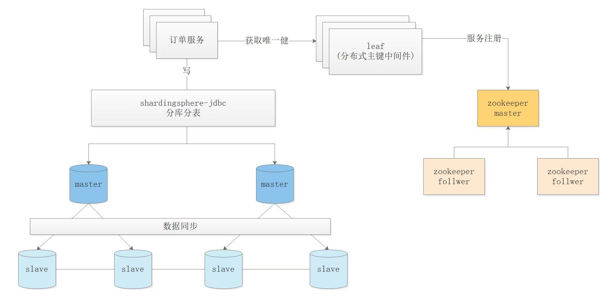

# 架构图


## 数据分片(已实现)
    
## 读写分离（已实现）

# 数据库相关配置

## 数据库配置 1主2从
- master 创建备份用户，用于给 slave 读 master 的 binlog
```mysql
CREATE USER 'repl'@'%' IDENTIFIED BY '123456';
GRANT REPLICATION SLAVE ON *.* TO 'repl'@'%';
FLUSH PRIVILEGES
```

- slave  
``` 
1. 从 master 获取 MASTER_LOG_FILE=<...>, MASTER_LOG_POS=<...> 用于步骤2
    SHOW MASTER STATUS;

2. 根据步骤1的信息填充<...>
    CHANGE MASTER TO 
    MASTER_HOST='mysql-0',
    MASTER_PORT=3306,MASTER_USER='repl',
    MASTER_PASSWORD='123456',MASTER_LOG_FILE='<...>',MASTER_LOG_POS=<...>;
    
    如：
    CHANGE MASTER TO 
    MASTER_HOST='mysql-0',
    MASTER_PORT=3306,MASTER_USER='repl',
    MASTER_PASSWORD='123456',MASTER_LOG_FILE='binlog.000007',MASTER_LOG_POS=156;
3. START SLAVE;
```

## TODO
- 双主多从，解决单点故障
  
- ShardingSphere-JDBC 改用 [ShardingSphere-Proxy](https://shardingsphere.apache.org/document/current/cn/user-manual/shardingsphere-proxy/)
  相关资料：
    - [元数据持久化仓库](https://shardingsphere.apache.org/document/current/cn/user-manual/shardingsphere-jdbc/builtin-algorithm/metadata-repository/#zookeeper-持久化) 

## 参考链接

- [数据库主从备份](https://blog.csdn.net/u013068184/article/details/107691389#:~:text=%E6%95%B0%E6%8D%AE%E5%BA%93%E4%B8%BB%E4%BB%8E%E5%A4%8D%E5%88%B6%EF%BC%8C%E5%B0%B1%E6%98%AF,%E5%89%8D%E6%8F%90%EF%BC%9A%E6%95%B0%E6%8D%AE%E5%BA%93%E7%89%88%E6%9C%AC%E9%9C%80%E8%A6%81%E4%B8%80%E8%87%B4%EF%BC%81)

- [binlog](https://dev.mysql.com/doc/refman/8.0/en/binary-log-setting.html)
